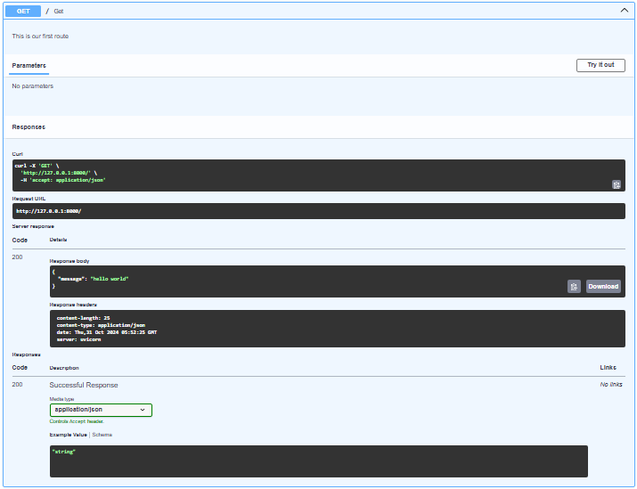

# Fast API
FastAPI is a modern, fast (high-performance), web framework for building APIs with Python based on standard Python type hints.

# Initial Git Set Up
  
  -   echo "# fastapi_project" >> README.md
  -   git init
  -   git add README.md
  -   git commit -m "first commit"
  -   git branch -M main
  -   git remote add origin https://github.com/PemaGyalpo97/fastapi_project.git
  -   git push -u origin main

# Push an existing repository

  -   git remote add origin https://github.com/PemaGyalpo97/fastapi_project.git
  -   git branch -M main
  -   git push -u origin main

# Intallation of Fast API
  - Install Python
  
  - Set up virtual env [Not Mandatory but benefits given below]
    - python -m venv {env name}
      - Need for Venv
        - Dependency Isolation
        - Avoid system-wide changes (installing software)
        - Version control with requirements.txt
        - Ease of clean (Once the project is done, delete the venv)
  
  - Activate Env
    - Windows
      - {env name}/Scripts/activate
    - Linux / Mac
      - {env name}/bin/activate
  
  - Issue while activating (Unauthorized issue)
    - Open Powershell not CMD as Administrator
    - Enter
      - Set-ExecutionPolicy -ExecutionPolicy RemoteSigned -Scope CurrentUser
      - Confirm by typing 'Y'
  
  - Upgrade the pip 
    - python.exe -m pip install --upgrade pip
  
  - Complete the requirements.txt 
    - List dependencies to be installed
  
  - Installation 
    - Install the requirements.txt [will install all the listed dependencies]
      - pip install -r requirements.txt

  - Define the main.py file
    - Instantiate an app inside the main file

  - Run the app
    - uvicorn main:app

  - Access the app from http://127.0.0.1:8000

  - Flags while running uvicorn main:app
    - --port= [availablt and desired port can be allocated]
    - --reload [changes saved in app, auto reloads the server]
  
# Fast API app at http://127.0.0.1:8000
  - Under the default section, list of routes available as defined in main file at http://127.0.0.1:8000/docs

  - Get Method 

  - To test the APIs, Click on the [ Try it out --> Execute ]
